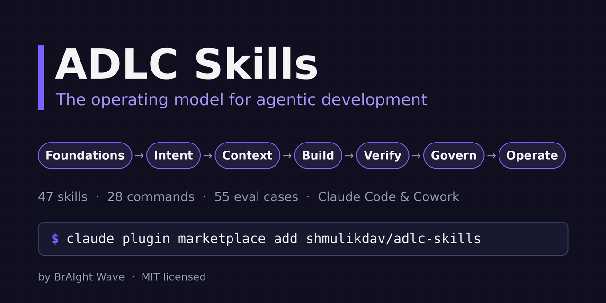
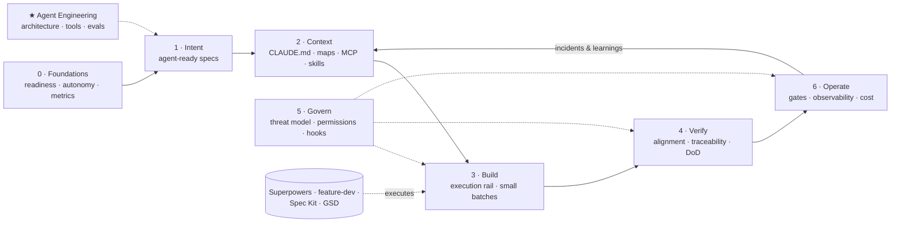

<p align="center"></p>

# ADLC Skills: The Operating Model for Agentic Development

> 47 skills, 28 commands, 2 agents, and 55 eval cases across 8 plugins. The layer that coding-agent frameworks leave out: readiness, agent-ready specs, architecture guardrails, context, review capacity, governance, Continuous AI, and agent engineering. Built for Claude Code and Cowork; composes with Superpowers and Anthropic's official plugins.

[](LICENSE) [](https://github.com/shmulikdav/adlc-skills/actions/workflows/tests.yml) [](https://github.com/shmulikdav/adlc-skills/releases) [](#installation) [](CONTRIBUTING.md)

## Try it in 60 seconds

```bash
claude plugin marketplace add shmulikdav/adlc-skills
claude plugin install adlc-foundations@adlc-skills
claude
```

Then paste:

```
/adlc-assess 40 engineers, Claude Code for everyone for two months, weekly deploys, ~35% test coverage, no written AI policy, PRs wait 3 days for review
```

You get a maturity level, a scorecard against the DORA AI capabilities and agent-specific readiness, the constraints that will break first, and three first moves. More role-based prompts: [docs/TRY-IT.md](docs/TRY-IT.md). Pre-launch audit against 2026 trends: [docs/LAUNCH-AUDIT.md](docs/LAUNCH-AUDIT.md).

## Why this kit exists

Coding agents changed who executes the software lifecycle. They did not change what makes delivery work. DORA's 2025 research calls AI an amplifier of the system it lands in. Teams with clear specs, fast tests, small batches, and real governance get faster. Teams without them get faster at producing rework.

The execution layer is already well served. Superpowers, Anthropic's `feature-dev` and `pr-review-toolkit`, and spec rails like Spec Kit do planning, TDD, and review inside a session. What no kit covered was the **operating model** around them: whether the org is ready, how much autonomy each task type gets, what an agent-ready spec looks like, how to govern agents that hold real permissions, how releases are gated, and how to prove any of it pays off.

The 2026 picture makes that layer urgent. Agent PRs now wait about five times longer for review than human ones, background agents run in CI, agents work for hours or days, business teams build their own tools, and agent-skill marketplaces have become a malware vector. Each of those has a plugin here.

AI adoption is an execution problem, not a technology problem. This kit encodes the execution.

## Built on evidence, measured with evals

Published benchmarks show that skills are not automatically good. Curated, domain-specific skills raised agent pass rates by 16 points on average in SkillsBench, while 39 of 49 generic software-engineering skills gave zero gain in SWE-Skills-Bench, and skills that induce unnecessary work are the top cause of skill-induced failures. So this kit:

- **Encodes organizational procedure**, the knowledge a model cannot have, instead of restating generic coding advice
- **Writes descriptions as trigger conditions**, because workflow summaries make agents skip the skill body
- **Ships a behavioral eval suite** for every skill: `claude plugin eval` runs each case with and without the plugin and reports the Δ
- **Recommends installing by role**, because focused sets of 2–3 skills outperform large bundles

Run the benchmark yourself: `claude plugin eval ./adlc-govern` (or any plugin). Details in [docs/REVIEW.md](docs/REVIEW.md).

**Benchmark status:** the suites are published; the first public WITH / W/OUT / Δ results will be posted here and in the release notes. Skills that don't show a positive Δ will be fixed or removed. Run it on your own model and share results in Discussions.

## Install by role

Install the profile that matches your job, not everything.

| You are… | Install | Start with |
|----------|---------|-----------|
| CTO / VP Eng / AI transformation lead | `adlc-foundations`, `adlc-operate` | `/adlc-assess`, `/adlc-roadmap` |
| Product manager | `adlc-intent` | `/write-agentic-prd` |
| Tech lead / staff engineer | `adlc-context`, `adlc-build`, `adlc-verify` | `/init-agent-context`, `/fix-review-queue`, `/choose-rail` |
| Platform / DevEx | `adlc-operate`, `adlc-govern` | `/plan-continuous-ai`, `/mine-rejections` |
| QA lead | `adlc-verify` | `/derive-tests` |
| Security | `adlc-govern` | `/threat-model`, `/vet-extension` |
| Business / operations leader enabling non-engineers | `adlc-govern` | `/citizen-builder-policy` |
| Building AI agents or LLM features | `adlc-agent-engineering`, `adlc-operate` | `/design-agent`, `/build-evals` |

**Recommended companion stack:** `superpowers` for execution discipline, `pr-review-toolkit` for code-quality review, `security-guidance` for code security, `claude-md-management` for context upkeep, all from the official marketplace. One owner per slot; see [docs/RECOMMENDED-STACK.md](docs/RECOMMENDED-STACK.md).

## The Lifecycle



| | SDLC | ADLC |
|---|------|------|
| Who builds | Humans write deterministic code | Agents execute; humans specify intent and constraints |
| What is reviewed | Code correctness | Behavioral alignment with intent |
| How it fails | Bugs: predictable, traceable | Plausible-but-wrong output: confident, invisible |
| What governs | Linters, PR review, CI | Context files, permissions, hooks, evals, gates |
| Bottleneck | Writing code | Specifying intent and verifying output |

"ADLC" is used in two senses. Most of this kit covers the **agentic** development lifecycle, software delivery executed by agents. `adlc-agent-engineering` covers the **agent** development lifecycle, building agents as products.

## How It Works

**Skills** are methods Claude loads automatically when a situation matches their trigger conditions; force one with `/plugin-name:skill-name`. **Commands** (`/command-name`) chain skills into workflows that pause at human gates. **Agents** run independent reviews in a fresh context (`agent-output-reviewer`, `security-reviewer`). **Evals** under each plugin's `evals/` measure whether every skill triggers on natural phrasing and improves the output over no plugin.

## Installation

### Claude Cowork

1. Open **Customize** → **Browse plugins** → **Personal** → **+**
2. Select **Add marketplace from GitHub**
3. Enter: `shmulikdav/adlc-skills`, then enable the plugins for your role

### Claude Code (CLI)

```bash
claude plugin marketplace add shmulikdav/adlc-skills
claude plugin install adlc-foundations@adlc-skills   # repeat for the plugins in your profile
```

All eight: `adlc-foundations`, `adlc-intent`, `adlc-context`, `adlc-build`, `adlc-verify`, `adlc-govern`, `adlc-operate`, `adlc-agent-engineering`.

### Codex CLI and other agents (skills only)

The `skills/*/SKILL.md` files follow the Agent Skills format. Commands, subagents, and evals are Claude Code features.

| Tool | How |
|------|-----|
| Codex CLI | `codex plugin marketplace add shmulikdav/adlc-skills`, then add plugins |
| Cursor | Copy skill folders to `.cursor/skills/` |
| Gemini CLI | Copy skill folders to `.gemini/skills/` |
| OpenCode | Copy skill folders to `.opencode/skills/` |

---

## Available Plugins

**1. adlc-foundations — Readiness, operating model & adoption (8 skills, 3 commands)**

- `adlc-readiness-assessment` — Score the seven DORA AI capabilities plus agent-specific readiness; get a maturity level and first moves
- `sdlc-to-adlc-mapping` — Map each workflow step to its agentic equivalent: executor, artifact, human gate, new failure mode
- `autonomy-levels` — Five-level delegation ladder per task type, scored on blast radius, reversibility, verifiability, spec clarity
- `ai-stance-policy` — A short, enforceable AI usage policy for engineering
- `adlc-metrics` — Measure outcomes, rework, and cost per change; separate perceived from actual productivity
- `ai-champions-program` — Train-the-trainer network that spreads practices, context files, and shared skills
- `role-transitions` — How developer, PM, QA, tech lead, manager, and designer roles change
- `comprehension-debt` — Keep humans able to explain and debug what agents build (explain-back gates, owners, drills)

Commands: `/adlc-assess` · `/map-to-adlc` · `/adlc-roadmap` (90-day Map → Prioritize → Build → Scale plan)

Examples: `/adlc-assess Platform team, 9 engineers, Claude Code for all, weekly deploys, 45% coverage` · `Can we let the agent do dependency upgrades on its own?`

**2. adlc-intent — Agent-ready specs (6 skills, 3 commands)**

- `agentic-prd` — Agent Execution Spec: intent, non-goals, guardrails, repo context, acceptance tests, stop conditions
- `spec-driven-development` — Constitution → specify → clarify → plan → tasks → implement → converge (Spec Kit, Kiro, AI-DLC aware)
- `acceptance-criteria` — Given/When/Then and EARS criteria, each with a verification method
- `spec-clarification` — Hunt ambiguities and silent decisions; prioritized questions with recommended defaults
- `task-decomposition` — Agent-sized, verifiable tasks with dependencies and parallel markers
- `architecture-guardrails` — ADRs agents read plus dependency rules and invariants CI enforces

Commands: `/write-agentic-prd` · `/spec-feature` · `/clarify-spec`

Examples: `/write-agentic-prd Let admins export audit logs as CSV` · `/clarify-spec interview me — bulk user import`

**3. adlc-context — Context engineering (6 skills, 4 commands)**

- `agent-context-files` — Write or audit CLAUDE.md / AGENTS.md: the smallest file that prevents the most expensive mistakes
- `codebase-map` — Modules, core flows, change recipes, and a risk register for agents and humans
- `context-budget` — What to load always, on demand, or in subagents; session handoff with plan/progress files
- `codify-conventions` — Decide whether know-how becomes a context line, skill, hook, or test, then write it
- `mcp-integration-plan` — Make internal data agent-accessible with least privilege and injection awareness
- `skill-library-management` — Keep, fix, or cut skills by measured Δ; description and load-budget standards from the benchmarks

Commands: `/init-agent-context` · `/map-codebase` · `/codify-convention` · `/audit-skills`

**4. adlc-build — Execution stack & delivery shape (4 skills, 3 commands)**

This plugin does not ship its own coding workflow. It picks and wires the best one.

- `execution-rail-selection` — One owner per slot across Superpowers, Spec Kit, GSD, BMAD, gstack, and built-in plan mode
- `long-running-agent-work` — Multi-hour and multi-agent runs with state files, checkpoints, budgets, and abort criteria
- `small-batch-delivery` — PR budgets, stacked PRs, flags, trunk-based integration, rollback readiness
- `legacy-modernization` — Characterize behavior first, extract the implicit spec, migrate in parity-checked slices (pairs with the official `code-modernization` plugin)

Commands: `/choose-rail` · `/plan-long-run` · `/modernize`

**5. adlc-verify — Review capacity & behavioral validation (6 skills, 4 commands, 1 agent)**

- `review-capacity` — Fix the agent-PR review bottleneck: ownership, risk tiers, machine first pass, WIP limits
- `behavioral-testing` — Properties, invariants, contracts, state transitions, permission matrices
- `tests-from-specs` — Traceability matrix from ACs or Xray/TestRail/Gherkin; generate the missing tests
- `agent-code-review` — Spec-alignment review tuned to AI failure patterns (composes with `pr-review-toolkit`)
- `hallucination-checks` — Verify packages, APIs, config keys, flags, paths, and PR claims actually exist
- `definition-of-done` — Evidence an agent must attach before "done", and the human gates that remain

Commands: `/fix-review-queue` · `/review-agent-pr` · `/derive-tests` · `/verify-change` — Agent: `agent-output-reviewer`

**6. adlc-govern — Security, permissions & compliance (6 skills, 4 commands, 1 agent)**

- `agentic-threat-model` — Walk the OWASP Top 10 for Agentic Applications (ASI01–ASI10) for your setup
- `agent-permissions` — Allow / ask / deny profiles for local, CI, and review-only agents
- `guardrail-hooks` — Deterministic enforcement for rules that must never break (template included)
- `ai-compliance-mapping` — Map practices to ISO/IEC 42001, NIST AI RMF, EU AI Act, SOC 2; list the evidence pack
- `extension-vetting` — Review skills, plugins, MCP servers, and hooks before installing them, including 2026 attack patterns (fake popularity, hidden Unicode, rug pulls)
- `citizen-builder-governance` — Paved road for non-engineers building tools with AI: tiers, data rules, inventory, promotion

Commands: `/threat-model` · `/governance-pack` · `/vet-extension` · `/citizen-builder-policy` — Agent: `security-reviewer`

**7. adlc-operate — Release, observe, learn (6 skills, 4 commands)**

- `continuous-ai-workflows` — Background agents for triage, CI failures, docs, tests, and cleanup, with proposal-only outputs
- `learning-loop` — Turn rejected agent PRs and repeated review comments into context, hooks, tests, and evals
- `release-gates` — Merge / staging / production / post-release gates by change class
- `agentops-observability` — Traces, redaction, quality and cost views, alerts for loops and anomalies
- `ai-cost-management` — Unit economics, cost levers with quality guardrails, 2×/5× price stress tests
- `agent-incident-review` — Blameless reviews that find which layer failed and feed fixes back into context, hooks, tests, and evals

Commands: `/release-check` · `/plan-continuous-ai` · `/mine-rejections` · `/agent-postmortem`

**8. adlc-agent-engineering — Building agents as products (5 skills, 3 commands)**

- `agent-architecture` — Simplest pattern that works: single call → workflow → agent loop
- `tool-design` — Task-shaped tools with clear descriptions, teaching errors, and explicit side effects
- `eval-suite-design` — Tasks, graders, capability vs regression evals, trials, CI gates
- `prompt-versioning` — Prompts, tool descriptions, and model pins as reviewed, versioned code
- `agent-runtime-guardrails` — Input provenance, tool allow-lists, approvals, limits, kill switch

Commands: `/design-agent` · `/build-evals` · `/red-team-agent`

---

## FAQ

**Does installing a plugin run any code on my machine?**
No. The plugins contain Markdown skills, commands, and agent definitions only: no hooks, MCP servers, or binaries. The hook in `templates/` is opt-in; you copy it yourself. See [SECURITY.md](SECURITY.md).

**How is this different from Superpowers or Spec Kit?**
Those run the work inside a session: planning, TDD, review. ADLC Skills covers what surrounds it: readiness, autonomy policy, agent-ready specs, governance of the agent setup, release gates, cost, and measurement. Use them together; `/choose-rail` helps you pick.

**Should I install all eight plugins?**
No. Benchmarks show focused skill sets beat large bundles. Install the profile for your role.

**Does it work outside Claude Code?**
Skills follow the Agent Skills format and work in Cowork, Codex, Cursor, Gemini CLI, and OpenCode. Slash commands, subagents, and evals are Claude Code features.

**Can I use it with clients or inside my company?**
Yes. MIT licensed: use, fork, and adapt it, including commercially. Keep the license notice.

## Research Foundations

The skills synthesize public research and practice. Full notes and sources: [docs/ADLC-RESEARCH.md](docs/ADLC-RESEARCH.md).

- SkillsBench, SWE-Skills-Bench, and *Agent Skills Can Be Harmful* — what makes skills help or hurt
- DORA — *State of AI-assisted Software Development* (2025) and the *DORA AI Capabilities Model*
- METR — randomized trial on AI and experienced open-source developer productivity (2025)
- Anthropic — Claude Code best practices; *Building effective agents*; *Writing effective tools for agents*; *Effective context engineering*; *Demystifying evals for AI agents*
- GitHub Spec Kit — Specification-Driven Development
- AWS — AI-Driven Development Lifecycle (AI-DLC) open-source workflows
- OWASP GenAI Security Project — *Top 10 for Agentic Applications (2026)*
- NIST AI RMF, ISO/IEC 42001, EU AI Act

## About

Created by **Shmulik Davar**, Founder & CEO of [BrAIght Wave](https://www.braightwave.com) (AI Strategy & Applied Solutions) and AI lecturer at Reichman University. The kit distills methods used in ADLC discovery and enablement work with engineering organizations. The methodology behind it: Map → Prioritize → Build → Scale.

Need help rolling ADLC out in your organization? [braightwave.com](https://www.braightwave.com)

Structure inspired by [phuryn/pm-skills](https://github.com/phuryn/pm-skills); skill-writing standards informed by [Superpowers](https://github.com/obra/superpowers).

## Contributing

See [CONTRIBUTING.md](CONTRIBUTING.md), [CODE_OF_CONDUCT.md](CODE_OF_CONDUCT.md), and [SECURITY.md](SECURITY.md). Skill ideas: open a *Skill proposal* issue. New skills must include eval cases and show a positive Δ. Run `python3 scripts/eval_cases.py`, `python3 scripts/sync_manifests.py`, `python3 validate_plugins.py`, and `python3 -m unittest discover -s tests` before opening a PR.

## License

MIT — see [LICENSE](LICENSE).
