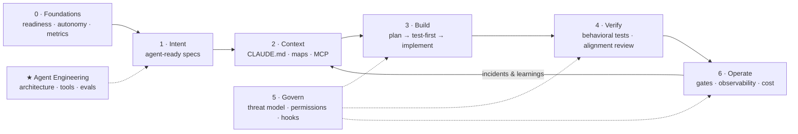

# ADLC Skills: The Agentic Development Lifecycle, as Skills

> 41 skills, 23 commands, and 2 agents across 8 plugins. Built for Claude Code and Cowork; skills work in any tool that reads the Agent Skills format. From readiness and agent-ready specs to context engineering, agentic build, verification, governance, operations, and agent engineering.

[](LICENSE) [](.github/workflows/tests.yml)

## Start Here

Are we ready? → `/adlc-assess`
Where do agents fit in our process? → `/map-to-adlc`
Turning a ticket into something an agent can execute → `/write-agentic-prd`
Setting up a repo for agents → `/init-agent-context`
Reviewing a PR an agent wrote → `/review-agent-pr`
Locking down agent permissions → `/threat-model`
Building an agent of your own → `/design-agent`

## Why ADLC Skills?

Coding agents changed who executes the software lifecycle. They did not change what makes delivery work. The 2025 DORA research puts it plainly: AI is an amplifier of the system it lands in. Teams with clear specs, fast tests, small batches, and real governance get faster. Teams without them get faster at producing rework.

AI adoption is an execution problem, not a technology problem. These skills encode the execution: how to specify intent so an agent doesn't guess, how to give it context without drowning it, how to verify output that is plausible but wrong, and how to govern agents that act with real permissions.

Each skill is a structured method, not a prompt. Each command chains skills into an end-to-end workflow with human gates where judgment matters.

## The Lifecycle



| | SDLC | ADLC |
|---|------|------|
| Who builds | Humans write deterministic code | Agents execute; humans specify intent and constraints |
| What is reviewed | Code correctness | Behavioral alignment with intent |
| How it fails | Bugs: predictable, traceable | Plausible-but-wrong output: confident, invisible |
| What governs | Linters, PR review, CI | Context files, permissions, hooks, evals, gates |
| Bottleneck | Writing code | Specifying intent and verifying output |

A note on the name: "ADLC" is used in two senses. Most of this marketplace covers the **agentic** development lifecycle, software delivery executed by agents. The `adlc-agent-engineering` plugin covers the other sense, the **agent** development lifecycle, for teams building agents as products.

## How It Works

**Skills** are the building blocks. Each gives the agent a method for one ADLC task, with a template and a quality bar. Skills load automatically when the conversation matches their description; force one with `/plugin-name:skill-name`.

**Commands** are user-triggered workflows (`/command-name`) that chain skills, pause at human gates, and suggest the next step.

**Agents** are subagents for work that benefits from a fresh, independent context: `agent-output-reviewer` and `security-reviewer`.

**Plugins** group skills, commands, and agents by lifecycle phase. Install all eight or only what you need; plugins never hard-depend on each other.

## Installation

### Claude Cowork

1. Open **Customize** → **Browse plugins** → **Personal** → **+**
2. Select **Add marketplace from GitHub**
3. Enter: `braightwave/adlc-skills`

### Claude Code (CLI)

```bash
claude plugin marketplace add braightwave/adlc-skills

claude plugin install adlc-foundations@adlc-skills
claude plugin install adlc-intent@adlc-skills
claude plugin install adlc-context@adlc-skills
claude plugin install adlc-build@adlc-skills
claude plugin install adlc-verify@adlc-skills
claude plugin install adlc-govern@adlc-skills
claude plugin install adlc-operate@adlc-skills
claude plugin install adlc-agent-engineering@adlc-skills
```

### Codex CLI and other agents (skills only)

The `skills/*/SKILL.md` files follow the Agent Skills format. Slash commands and subagents are Claude Code features; elsewhere, describe the workflow in plain language and the skills will load.

| Tool | How |
|------|-----|
| Codex CLI | `codex plugin marketplace add braightwave/adlc-skills`, then add plugins |
| Cursor | Copy skill folders to `.cursor/skills/` |
| Gemini CLI | Copy skill folders to `.gemini/skills/` |
| OpenCode | Copy skill folders to `.opencode/skills/` |

```bash
# Example: copy all skills into a project for Cursor
for plugin in adlc-*/; do mkdir -p .cursor/skills && cp -r "$plugin/skills/"* .cursor/skills/ 2>/dev/null; done
```

---

## Available Plugins

**1. adlc-foundations — Readiness, operating model & adoption (7 skills, 3 commands)**

- `adlc-readiness-assessment` — Score the seven DORA AI capabilities plus agent-specific readiness; get a maturity level and first moves
- `sdlc-to-adlc-mapping` — Map each workflow step to its agentic equivalent: executor, artifact, human gate, new failure mode
- `autonomy-levels` — Five-level delegation ladder per task type, scored on blast radius, reversibility, verifiability, spec clarity
- `ai-stance-policy` — A short, enforceable AI usage policy for engineering
- `adlc-metrics` — Measure outcomes, rework, and cost per change; separate perceived from actual productivity
- `ai-champions-program` — Train-the-trainer network that spreads practices, context files, and shared skills
- `role-transitions` — How developer, PM, QA, tech lead, manager, and designer roles change

Commands: `/adlc-assess` · `/map-to-adlc` · `/adlc-roadmap` (90-day Map → Prioritize → Build → Scale plan)

Examples: `/adlc-assess Platform team, 9 engineers, Claude Code for all, weekly deploys, 45% coverage` · `Can we let the agent do dependency upgrades on its own?`

**2. adlc-intent — Agent-ready specs (5 skills, 3 commands)**

- `agentic-prd` — Agent Execution Spec: intent, non-goals, guardrails, repo context, acceptance tests, stop conditions
- `spec-driven-development` — Constitution → specify → clarify → plan → tasks → implement → converge (Spec Kit, Kiro, AI-DLC aware)
- `acceptance-criteria` — Given/When/Then and EARS criteria, each with a verification method
- `spec-clarification` — Hunt ambiguities and silent decisions; prioritized questions with recommended defaults
- `task-decomposition` — Agent-sized, verifiable tasks with dependencies and parallel markers

Commands: `/write-agentic-prd` · `/spec-feature` · `/clarify-spec`

Examples: `/write-agentic-prd Let admins export audit logs as CSV` · `/clarify-spec interview me — bulk user import`

**3. adlc-context — Context engineering (5 skills, 3 commands)**

- `agent-context-files` — Write or audit CLAUDE.md / AGENTS.md: the smallest file that prevents the most expensive mistakes
- `codebase-map` — Modules, core flows, change recipes, and a risk register for agents and humans
- `context-budget` — What to load always, on demand, or in subagents; session handoff with plan/progress files
- `codify-conventions` — Decide whether know-how becomes a context line, skill, hook, or test, then write it
- `mcp-integration-plan` — Make internal data agent-accessible with least privilege and injection awareness

Commands: `/init-agent-context` · `/map-codebase` · `/codify-convention`

**4. adlc-build — Agentic construction (5 skills, 3 commands)**

- `explore-plan-implement` — The core loop: read-only exploration, reviewable plan, verified implementation, traceable commit
- `agentic-tdd` — Tests first from acceptance criteria; implement without touching the tests
- `parallel-agents` — Worktrees, writer/reviewer pairs, competing hypotheses; concurrency capped by review capacity
- `small-batch-delivery` — PR budgets, stacked PRs, flags, trunk-based integration, rollback readiness
- `legacy-modernization` — Characterize behavior first, extract the implicit spec, migrate in parity-checked slices

Commands: `/plan-feature` · `/build-feature` · `/modernize`

**5. adlc-verify — Behavioral validation & review (5 skills, 3 commands, 1 agent)**

- `behavioral-testing` — Properties, invariants, contracts, state transitions, permission matrices
- `tests-from-specs` — Traceability matrix from ACs or Xray/TestRail/Gherkin; generate the missing tests
- `agent-code-review` — Five-pass alignment review tuned to AI failure patterns
- `hallucination-checks` — Verify packages, APIs, config keys, flags, paths, and PR claims actually exist
- `definition-of-done` — Evidence an agent must attach before "done", and the human gates that remain

Commands: `/review-agent-pr` · `/derive-tests` · `/verify-change` — Agent: `agent-output-reviewer`

**6. adlc-govern — Security, permissions & compliance (5 skills, 3 commands, 1 agent)**

- `agentic-threat-model` — Walk the OWASP Top 10 for Agentic Applications (ASI01–ASI10) for your setup
- `agent-permissions` — Allow / ask / deny profiles for local, CI, and review-only agents
- `guardrail-hooks` — Deterministic enforcement for rules that must never break (template included)
- `ai-compliance-mapping` — Map practices to ISO/IEC 42001, NIST AI RMF, EU AI Act, SOC 2; list the evidence pack
- `extension-vetting` — Review skills, plugins, MCP servers, and hooks before installing them

Commands: `/threat-model` · `/governance-pack` · `/vet-extension` — Agent: `security-reviewer`

**7. adlc-operate — Release, observe, learn (4 skills, 2 commands)**

- `release-gates` — Merge / staging / production / post-release gates by change class
- `agentops-observability` — Traces, redaction, quality and cost views, alerts for loops and anomalies
- `ai-cost-management` — Unit economics, cost levers with quality guardrails, 2×/5× price stress tests
- `agent-incident-review` — Blameless reviews that find which layer failed and feed fixes back into context, hooks, tests, and evals

Commands: `/release-check` · `/agent-postmortem`

**8. adlc-agent-engineering — Building agents as products (5 skills, 3 commands)**

- `agent-architecture` — Simplest pattern that works: single call → workflow → agent loop
- `tool-design` — Task-shaped tools with clear descriptions, teaching errors, and explicit side effects
- `eval-suite-design` — Tasks, graders, capability vs regression evals, trials, CI gates
- `prompt-versioning` — Prompts, tool descriptions, and model pins as reviewed, versioned code
- `agent-runtime-guardrails` — Input provenance, tool allow-lists, approvals, limits, kill switch

Commands: `/design-agent` · `/build-evals` · `/red-team-agent`

---

## Research Foundations

The skills synthesize public research and practice. Full notes and sources: [docs/ADLC-RESEARCH.md](docs/ADLC-RESEARCH.md).

- DORA — *State of AI-assisted Software Development* (2025) and the *DORA AI Capabilities Model*
- METR — randomized trial on AI and experienced open-source developer productivity (2025)
- Anthropic — Claude Code best practices; *Building effective agents*; *Writing effective tools for agents*; *Effective context engineering*; *Demystifying evals for AI agents*
- GitHub Spec Kit — Specification-Driven Development
- AWS — AI-Driven Development Lifecycle (AI-DLC) open-source workflows
- OWASP GenAI Security Project — *Top 10 for Agentic Applications (2026)*
- NIST AI RMF, ISO/IEC 42001, EU AI Act

## About

Curated by Shmulik Davar, Founder & CEO of [BrAIght Wave](https://www.braightwave.com) (AI Strategy & Applied Solutions), AI lecturer at Reichman University. The methodology behind it: Map → Prioritize → Build → Scale.

Inspired by the structure of [phuryn/pm-skills](https://github.com/phuryn/pm-skills).

## Contributing

See [CONTRIBUTING.md](CONTRIBUTING.md). Run `python3 scripts/sync_manifests.py`, `python3 validate_plugins.py`, and `python3 -m unittest discover -s tests` before opening a PR.

## License

MIT — see [LICENSE](LICENSE).
